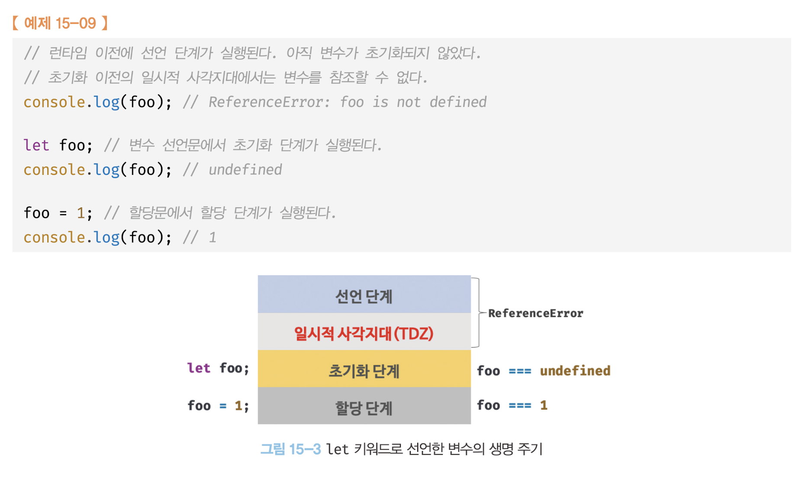

# 1 week : 각각에 변수 스코프 차이 이해하기

## 일시적 사각지대 (TDZ - Temporal Dead Zone)

스코프의 시작 지점부터 초기화 시작 지점까지 변수를 참조할 수 없는 구간을 **일시적 사각지대**라고 한다.

var는 일시적 사각지대가 없음 그렇기 때문에 undefined가 나오는 것이다.
const, let은 일시적 사각지대가 있음



## Scope(영역)

컴퓨터 프로그래밍에서 변수 영역은 변수가 유효성을 갖는 영역을 말한다.

### 전역 영역(Global Scope)

- 가장 간단한 변수 영역은 소스 코드 상의 모든 곳에서 사용할 수 있는 전역 변수.
- 전역 변수는 많은 언어에서 나쁜 관습으로 취급 되지만, 그런 경우에도 함수 명이나 클래스 명은 대부분 전역에서 접근할 수 있다.

### 함수 영역(Function Scope)

- 대부분의 프로그래밍 언어와 달리 JavaScript는 함수 안에서만 유효한 지역 변수를 제공한다.
- 함수 영역에서 사용 되는 지역 변수는 함수가 반환되면 더 이상 사용할 수 없다.
- 함수 영역 밖에서는 접근이 불가능!!! (보호된다)
- 함수 내에서 변수를 선언할 때 꼭! 반!드!시! var키워드 사용하기

## 호이스팅 (Hoisting)

JS는 `var`, `function 선언문`을 사용할 경우, 브라우저가 해석하는 과정에서 영역 최상위로 끌어올리는 현상을 보이는데 이것을 호이스트라고 한다.

끌어올려지는 것이 아닌 정확히 말하면 “메모리에 등록이 된다”가 맞는 말이다. (둘리의 호잇! 호잇! 생각하면 암기가 쉽다.)

변수는 원래 먼저 선언이 되어 있어야 하는데 만약 없으면 오류를 유발한다. 하지만 자바스크립트는 선언된 변수가 없다면 영역 내의 선언된 다른 변수를 상위로 끌어올리려고 한다.

### 예제

```jsx
import { string, number, oneOf, oneOfType } from 'prop-types';

export const iconTypes = ['unicorn', 'rainbow', 'checked', 'unchecked', 'loading'];

interface Props {
  id: string;
  label: string;
  size?: number;
  width: number;
  height: number;
  pagename?: string;
}

export function SVGIcon({
  id,
  label,
  size,
  width = 24,
  height = 24,
  pagename = 'sprites',
  ...rest
}: Props) {
  return (
    <svg
      css={{ display: 'block' }}
      role="img"
      aria-label={label}
      width={size ?? width}
      height={size ?? height}
      viewBox={`0 0 ${width} ${height}`}
      {...rest}
    >
      <use href={`${switchSprite(pagename)}#${id}`} />
    </svg>
  );
}

function switchSprite(name: string) {
  switch (name) {
    case 'dranswer':
      return '/static/sprites/dranswer.svg';
    case 'admin':
      return '/static/sprites/admin.svg';
    default:
      return '/static/sprites/sprites.svg';
  }
}

SVGIcon.propTypes = {
  /** 아이콘 ID */
  id: string,
  /** 아이콘 레이블 (의미를 가질 경우 설정) */
  label: string.isRequired,
  /** 아이콘 너비, 높이 일괄 설정 */
  size: oneOfType([number, string]),
  /** 아이콘 너비 설정 */
  width: oneOfType([number, string]),
  /** 아이콘 높이 설정 */
  height: oneOfType([number, string]),
  /** 스프라이트가 사용되는 페이지 이름을 지정할 수 있습니다. */
  pagename: oneOf(['dranswer', 'sprites', 'admin']),
};
```

## 컨텍스트(Context)

영역, 범위라고 한다. 예를들어 내가 “학교”에 있다면 내 컨텍스트는 “학교”이다. 만약 카페에서 일을 하고 있다면 내 현재 실행 컨텍스트는 카페이다.

### 실행 컨텍스트

어떠한 대상이 일을 하는 영역(또는 범위)이다.

### 함수 실행 컨텍스트

- 함수가 가지는 function scope라고 생각하면 이해가 쉽다.
- 매개변수에 전달 받은 값을 함수 블럭에 전달하여 변수에 할당하고 조건을 실행하고 값을 반환하는 등, 함수가 일하는 모든 영역을 함수 실행 컨텍스트이다. 즉, 함수가 실행되어 종료될 때까지의 영역(context)을 말한다.
- 모든 함수에는 실행 컨텍스트가 있다. 실행 컨텍스트는 해당 함수 내의 변수와 해당 부모 환경에 대한 참조를 의미하는 환경으로 구성된다. 상위 환경에 대한 참조는 내부 함수가 작성된 범위 외부 또는 내부에서 호출 되는지 여부에 관계없이 상위 범위의 모든 변수를 모든 내부 함수에 사용할 수 있게 한다.
- 따라서 함수가 사실상 환경(해당 환경에 정의된 변수)에 대한 참조를 가지고 있기 때문에 함수가 이 환경(또는 영역)을 “기억”하는 것처럼 보인다!
- 모든 실행 컨텍스트에는 어휘 환경(Lexical Environment)이 있다. 이 어휘 환경은 식별자 바인딩(즉, 변수 및 관련 값)을 보유하고 있으며 외부 환경에 대한 참조도 가지고 있다.
- 각 환경이 접근 할 수 있는 일련의 식별자를 “범위(Scope)”라고 한다. 이러한 범위를 “스코프 체인(Scope Chain)”을 통해 계층적 환경 체인에 중첩 할 수 있다.
