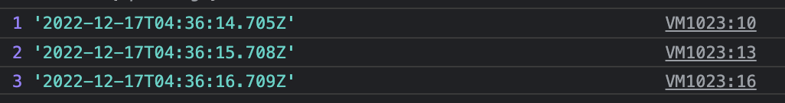
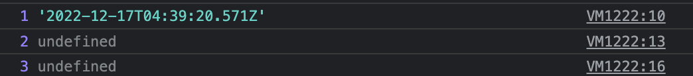
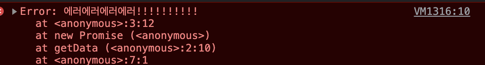
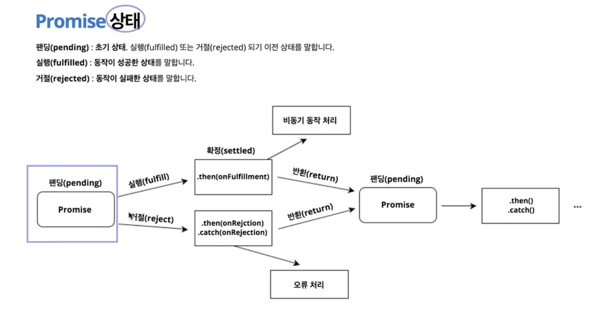

# 3week : web api

Date Created: December 10, 2022 1:17 PM

# **타이머 메서드**

setTimeout(), setInterval(), clearTimeout()

## **setTimeout()**

**setTimeout() 메서드는 일정 시간(밀리초 단위)이 흐른 후에 실행할 함수를 지정한다.** setTimeout()의 반환값을 clearTimeout() 메서드의 인자로 사용하면 계획된 함수의 실행을 취소할 수 있다.

## **setInterval()**

**setInterval() 메서드는 지정한 밀리초 주기마다 함수를 반복적으로 호출한다**는 점을 제외하면 setTimeout() 메서드와 비슷하다. setTimeout()처럼 setInterval()도 clearTimeout() 메서드를 사용하여 계획된 함수의 실행을 취소할 수 있도록 타이머 ID값을 반환한다.

## **[clearTimeout()](https://developer.mozilla.org/en-US/docs/Web/API/WindowOrWorkerGlobalScope/clearTimeout)**

```jsx
const clearId = window.setTimeout(() => setIsShow(false), 4000);

window.clearTimeout(clearId);
```

# **Promise**

<aside>
💡 Promise는 비동기 조작의 최종 완료(Resolve) 또는 실패(Reject)를 나타내는 객체이다. 그리고 Fetch API를 이용하면 요청(Request), 응답(Resposne)와 같은 HTTP의 파이프라인을 구성하는 요소를 조작하는것이 가능하다.

</aside>

`promise` 객체는 비동기 처리를 위한 목적으로 사용되며, 당장은 아니더라도 나중에 처리 될 것으로 기대되는 연산을 수행할 때 사용한다.

콜백 함수를 사용해서 시간 지연에 따라 Data()객체를 출력하는 코드이다.

```jsx
function delay(sec, callback) {
  return window.setTimeout(() => {
    callback(new Date().toISOString());
    // new Date().toISOString()를 callback함수의 인자인 result에 전달
  }, sec * 1000);
}

delay(1, (result) => {
  console.log(1, result);

  delay(1, (result) => {
    console.log(2, result);

    delay(1, (result) => {
      console.log(3, result);
    });
  });
});
```

**결과값**


위 코드에 프로미스를 적용하면 아래와 같은 코드가 된다.

```jsx
function delay(sec) {
  return new Promise((resolve, reject) => {
    window.setTimeout(() => {
      resolve(new Date().toISOString());
    }, sec * 1000);
  });
}

delay(1)
  .then((result) => {
    console.log(1, result);
    return delay(1);
  })
  .then((result) => {
    console.log(2, result);
    return delay(1);
  })
  .then((result) => {
    console.log(3, result);
  });
```

**결과값**



Promise를 사용한 코드에서 1, 2, 3초 뒤에 log가 출력되게 하려면 아래와 같은 코드를 사용해야 한다. 하지만 이것은 콜백함수와 다를게 없다. 그렇기 때문에 첫번째 코드가 끝나면 다시 Promise 객체가 반환되어 `then()`
메서드를 사용할 수 있도록 코드를 만든다.

```jsx
delay(1).then((result) => {
  console.log(1, result);

  delay(1).then((result) => {
    console.log(2, result);

    delay(1).then((result) => {
      console.log(3, result);
    });
  });
});
```

만약 delay 함수를 리턴하지 않으면 어떻게 출력 될까?

```jsx
delay(1)
  .then((result) => {
    console.log(1, result);
  })
  .then((result) => {
    console.log(2, result);
  })
  .then((result) => {
    console.log(3, result);
  });
```

반환되는 값 없이 체이닝 메서드를 사용하면 처음에 나온 결과값을 가공하는 형식으로 작업이 진행되기 때문에 `undefined`가 된다.



## 프로미스의 에러 처리

Promise 함수 내부에서 오류가 생겼을 경우 reject 함수가 실행되면서 catch()로 설정한 오류 처리가 실행된다.

```jsx
function getData() {
  return new Promise(function (resolve, reject) {
    reject(new Error('에러에러에러에러!!!!!!!!!!'));
  });
}

getData()
  .then(function (data) {
    console.log(data); // response 값 출력
  })
  .catch(function (err) {
    console.error(err); // Error 출력
  });
```



## Promise 상태



**.then() 메서드**

비동기 통신에 성공 했을 때 실행

이 메서드를 사용하면 콜백 지옥에 빠지지 않도록 하고 관리가 용이하며 코드를 간소화 할 수 있다.

**.catch() 메서드**

비동기 통신에 실패 했을 때 실행되어 에러 메세지를 보여줌 (에러 메세지는 개발자를 위한 메세지이다.)

# Cookie

쿠키는 클라이언트에 대한 정보를 이용자의 PC의 하드디스크에 보관하기 위해서 웹 사이트에서 클라이언트의 웹 브라우저에 전송하는 정보이다.

- 웹 사이트에서 쿠키를 설정하면 이후 모든 웹 요청은 쿠키정보를 포함하여 서버로 전송된다.
- 하나의 사이트에서 저장할 수 있는 최대 쿠키 수는 20개이다. 그리고 하나의 사이트에서 저장할 수 있는 최대 쿠키 크기는 4KB로 제한되어 있다.
- 쿠키는 만료일자를 지정하게 되어 있어 언젠가 제거된다. 만료일자로 지정된 날짜에 쿠키는 제거되는 것이다. 만약 만료일자를 지정하지 않으면 세션 쿠키가 된다.

# **LocalStorage, SessionStorage**

Web Storage는 사이트의 도메인 단위로 접근이 제한된다. 도메인마다 별도로 스토리지가 생성이 된다.

## **LocalStorage**

- 저장한 데이터를 명시적으로 지우지 않는 이상 영구적으로 보관이 가능하다.
- Windows 전역 객체의 LocalStorage라는 컬렉션을 통해 저장과 조회가 이루어진다.
- 도메인마다 별도로 스토리지가 생성이 된다.

## **SessionStorage**

- SessionStorage는 데이터의 지속성과 액세스 범위에 특수한 제한이 존재한다.
- SessionStorage는 windows 전역 객체의 sessionStorage라는 컬렉션을 통해 저장과 조회가 이루어진다.
- SessionStorage는 데이터가 지속적으로 보관되지 않는다.
- 현재 페이지가 브라우징되고 있는 브라우저 컨텍스트 내에서만 데이터가 유지된다.
- 같은 사이트의 같은 도메인이라 할지라도 브라우저가 다르면 서로 다른 영역이 된다.

## **localStorage 사용하기**

**데이터 저장하기**

```jsx
localStorage.setItem('key', value);
```

**데이터 출력하기**

```jsx
localStorage.getItem('key');
```

**데이터 삭제하기**

```jsx
localStorage.removeItem('key');
localStorage.clear();
```

## 객체를 저장할 때

LocalStorage와 Session Storage에는 텍스트만 저장할 수 있다. 그래서 객체 또는 배열을 저장할 때 데이터가 깨지기 때문에 객체와 배열 데이터를 json으로 변경해서 저장해야한다.

```jsx
localStorage.setItem('obj', { name: 'hanna' });

localStorage.getItem('obj'); // '[object Object]'
```

```jsx
localStorage.setItem('obj', JSON.stringify({ name: 'hanna' }));

localStorage.getItem('obj'); // '{"name":"hanna"}'

const getItem = localStorage.getItem('obj'); // undefined

JSON.parse(getItem); // {name: 'hanna'}
```
